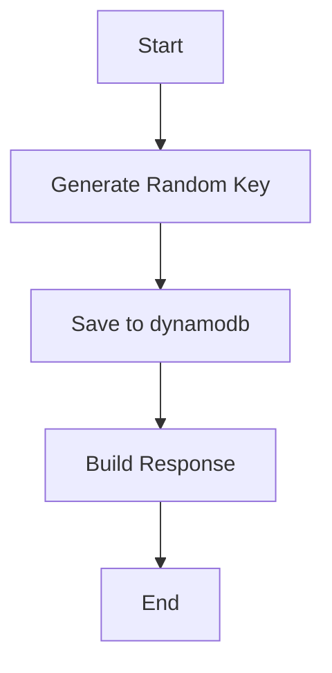
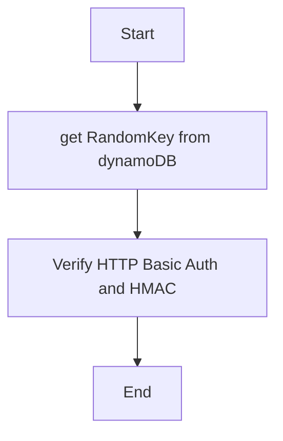
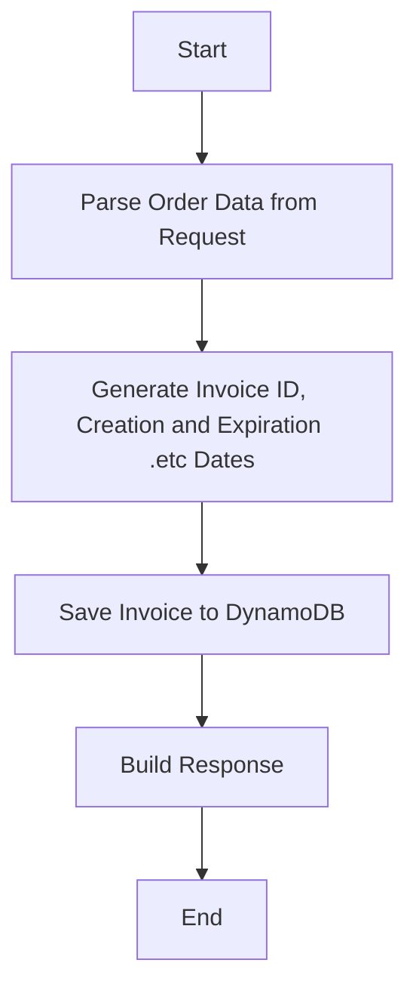
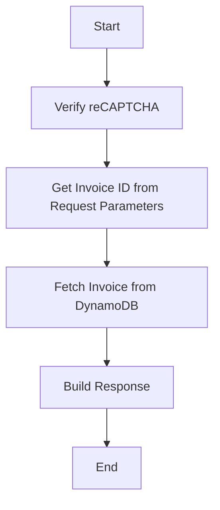

# 电子Invoice服务

## 服务分析

### 概述

###### 使用API Gateway,Lambda 和 DynamoDB 构建电子Invoice服务，要求该服务主要包括两个API，以一个用于商家保存/发布Invoice，另一个用于客人下载PDF格式的Invoice。

### API 要求

###### 

1. saveInvoice
* Method: POST
* Header: 使用 Base Authentication 和 HMAC 验证
* Body: 包含订单信息的 JSON 数据
* Describe: 商家保存/发布一个电子发票，以供客人下载保存

2. getInvoice
* Method: GET
* Header: 使用 Base Authentication 和 HMAC 验证
* Parameters: MD5 HASH KEY
* Describe: 客人通过此公开API访问并获取PDF格式的发票

### 数据库Dynamodb

###### 使用DynamoDB作为Invoice存储。每个Invoice都有一定的保存时间。该时间可以自定义。过期后删除该发票。

### 安全性
    
###### saveInvoice采取 Base Authentication 和 HMAC 验证
###### getInvoice 采取 reCAPTCHA 防止滥用

### 统计功能

###### 记录每个API的调用时间和header，body等信息。

### 环境支持

###### 支持两个不同的环境，测试（test）环境和生产（production）环境。在测试环境中，开发者可以测试和验证功能，而生产环境则用于实际业务场景。

### 压力测试

###### 通过模拟 高并发访问场景，需要知道解决方案能支持多少的最大请求书 PRS

### 短URL服务

###### 通过短URL服务能大大减少二维码的信息密度

## 系统设计

## API设计

1. saveInvoice
* Method: POST
* Header: 使用 Base Authentication 和 HMAC 验证
* Body: 包含订单信息的 JSON 数据
* Describe: 商家保存/发布一个电子发票，以供客人下载保存

2. getInvoice
* Method: GET
* Header: 使用 Base Authentication 和 HMAC 验证
* Parameters: MD5 HASH KEY
* Describe: 客人通过此公开API访问并获取PDF格式的发票

3. getRandomKey
* Method: GET
* Describe: 返回一个随机数作为客户的 key，用于进行 HMAC 哈希

## 数据库设计

## Table(Invoices)

| Key  | Type | Describe  | Value |
| ------------- |:-------------:|:-------------:|:-------------:|
| hashkey      | String     | 主键 | 202cb962ac59075b964b07152d234b70
| orders      | ?     | Json的格式 Key是菜名 value是价格 | [{"duck"：“10”}，{“chicken”:"8"}]
| orderNumber      | String     | 下单单号 | 123
| orderRefference      | String     | 参考 | 123
| type      | Int     | 送餐的形式 | pickup
| initTimeStamp      | Int     | 生成时间 | 1682494947
| expiredAt      | Int     | 过期时间 | 1682494947
| restaraunt      | String     | 餐厅名字 | Melbourne Best
| address      | String     | 餐厅地址 | 123 bourke st, Melbourne Vic
| Phone      | String     | 联系电话 | 0411111111
| qrcode      | String     | 存储该invoice的api地址 | 202cb962ac59075b964b07152d234b70

## Table(Session)
| Key  | Type | Describe  | Value |
| ------------- |:-------------:|:-------------:|:-------------:|
| sessionID      | String     | uuid格式 | 123e4567-e89b-12d3-a456-426614174000
| expiredAt      | Int     | 过期时间 | 1682494947

## Table(statistics)
| Key  | Type | Describe  | Value |
| ------------- |:-------------:|:-------------:|:-------------:|
| apiPath      | String     | url的路径 | /getInvoice
| totalCalls      | Number     | API 被调用的总次数 | 123456
| lastCalled      | Number     | API 最近一次被调用的时间戳 | 1682494947
| successCalls      | Number     | 	API 调用成功的次数 | 123456
| erroCalls      | Number     | 	API 调用发生错误的次数 | 123456

## Table(ShortUrlMapping)
| Key  | Type | Describe  | Value |
| ------------- |:-------------:|:-------------:|:-------------:|
| shortUrlPath      | String     | Url的短路径，也是主键 | /abc123
| longUrl      | String     | 原始长 URL | /invoice/abc8888
| createdat      | Number     | 短 URL 创建的时间戳 | 1682494947
| expiredAt      | Number     | 	短 URL 的过期时间戳 | 123456
| hitcount      | Number     | 	访问次数 | 123456

## 数据流程\业务逻辑

### 场景一：用户保存和发布发票

User Story 1.1: 作为用户，我需要访问 getRandomKey API 获取一个随机数，以便用于后续 HMAC 哈希操作。

User Story 1.2: 作为用户，我需要使用 HMAC 对我的密码进行哈希，以便使用哈希后的值进行身份验证。

User Story 1.3: 作为用户，我需要通过访问 saveInvoice API 并使用 Base Authentication 验证，将客人的订单信息提交并保存为电子发票。

Acceptance Criteria:

用户成功访问 getRandomKey API 并获取随机数
用户使用 HMAC 对密码进行哈希
用户访问 saveInvoice API (Base Authentication 验证)，提交包含订单信息的 JSON 数据
系统成功保存和发布电子发票

### 场景二：客人获取发票 PDF

User Story 2.1: 作为客人，我需要使用二维码或链接访问 getInvoice API，以便获取电子发票的基本信息。

User Story 2.2: 作为客人，我希望在客户端（网页或专用应用）上生成该发票的 PDF 文件，以便查看和保存。

Acceptance Criteria:

客人使用二维码或链接成功访问 getInvoice API
客人获取电子发票的基本信息
客户端（网页或专用应用）成功生成 PDF 文件
客人能够查看和保存 PDF 文件

## Lambda 设计

根据上述 User Story，我们需要实现 3 个 AWS Lambda 函数来处理不同的 API 请求。

* getRandomKey Lambda 函数

该函数负责生成一个随机数以供第二个auth Lambda 函数使用

* auth Lambda 函数

该函数负责进行身份验证 http auth hmac。如果身份验证成功，进行后续的处理。

(由API GATEWAY 的 Authorizers 调用)

* save\get Invoice Lambda 函数

## Test和production环境

根据以上的lambda函数分析，为test和production环境创建多个相应的Lambda函数和api gateway. 在Api的末尾添加标签，比如 'get-invoice-test' 和 'get-invoice-prod'

使用AWS 的 CodePipeline  和 CodeDeploy实现CI/CD实现自动化部署，在代码递交到Github(tag 或者 release)后，自动将代码部署到test和production的对应的lambda函数。

## 短url服务

* 使用API Gateway 创建一个新的API，用于处理短URL请求。

* 创建一个新的lambda函数，用于处理这个API Gateway的请求。在这个Lambda函数中，根据这个请求，从dynamodb中寻找原始的URL，并重定向到原始的URL。
