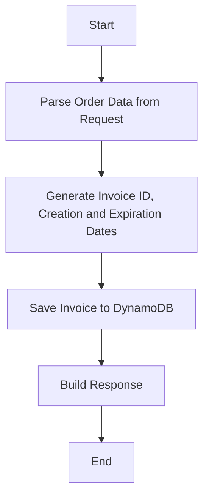

# hostloc

```mermaid
graph TD
A[Start] --> B[Parse Order Data from Request]
B --> C[Generate Invoice ID, Creation and Expiration Dates]
C --> D[Save Invoice to DynamoDB]
D --> E[Build Response]
E --> F[End]
```
